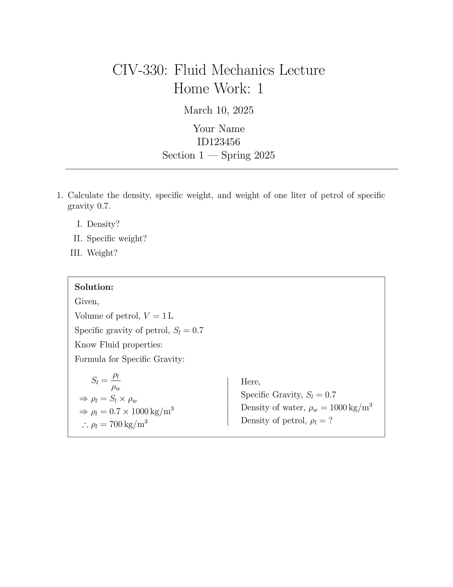

# Math / Engineering Related assignment Templates

## Bare Minimum

Latex $\rightarrow$ Math Engineering home works / assignment starter

```latex

% %%%%%%%%%% P R E A M B L E %%%%%%%%%% 
\documentclass[12pt,letterpaper, onecolumn]{exam}
\usepackage{amsmath}
\usepackage{amssymb}
\usepackage{siunitx}
\usepackage[lmargin=71pt, tmargin=1.2in]{geometry}  %For centering solution box
\usepackage{enumerate}
\usepackage{array}


\lhead{CIV330\\}
\rhead{ID123456\\}
% \chead{\hline} % Un-comment to draw line below header
\thispagestyle{empty}   %For removing header/footer from page 1

% %%%%%%%%%%%%%%%%%%%%%%%%%%%%%%%%%%%%%% 

\begin{document}

% {{{ Nice Title Heading

\begingroup  
    \centering
    \LARGE CIV-330: Fluid Mechanics Lecture\\
    \LARGE Home Work: 1\\[0.5em]
    \large \today\\[0.5em]
    \large Your Name\par
    \large ID123456\par
    \large Section 1 | Spring 2025\par
\endgroup
\rule{\textwidth}{0.4pt}
\pointsdroppedatright   %Self-explanatory
\printanswers
\renewcommand{\solutiontitle}{\noindent\textbf{Solution:}\enspace}   %Replace "Ans:" with starting keyword in solution box

% }}}

\begin{questions}


% {{{ Problem-1

    % Question
    \question[] Calculate the density, specific weight, and weight of one liter of
petrol of specific gravity 0.7.
        \begin{enumerate}[I.]
            \item Density?
            \item Specific weight?
            \item Weight?
        \end{enumerate}
    % \droppoints

    % Solution
    \begin{solution}

        Given,

        Volume of petrol, $V = \qty{1}{\liter}$

        Specific gravity of petrol, $S_l = 0.7$

        Know Fluid properties:

        Formula for Specific Gravity:
            \[
                % Left Part
                \begin{aligned}
                    &~ S_l = \frac{\rho_l}{\rho_w} \\
                    \Rightarrow&~ \rho_l = S_l \times \rho_w \\
                    \Rightarrow&~ \rho_l = 0.7 \times \qty{1000}{kg/m^3} \\
                    \therefore&~ \rho_l = \qty{700}{kg/m^3}
                \end{aligned}
                % Middle: Vertical Line
                \quad \hspace{2cm} \left\vert\quad
                % Right Part
                \begin{aligned}
                    &~\text{Here, }\\
                    &~\text{Specific Gravity, }S_l = 0.7 \\
                    &~\text{Density of water, }\rho_w = \qty{1000}{kg/m^3} \\
                    &~\text{Density of petrol, }\rho_l = \text{?} \\
                \end{aligned}
                \right.
            \]

    \end{solution}

% Problem-1 }}}


\end{questions}
\end{document}


```

*OutPut:* 
<!--  -->

